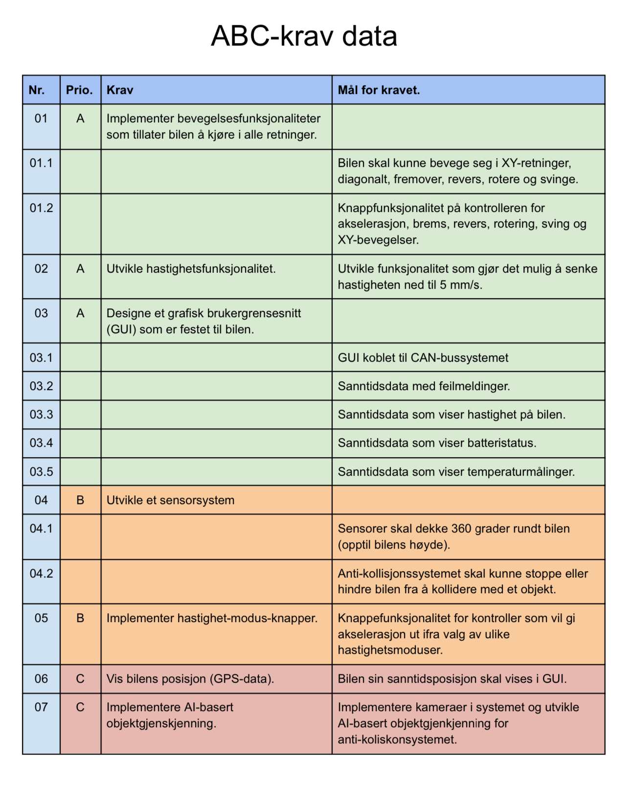
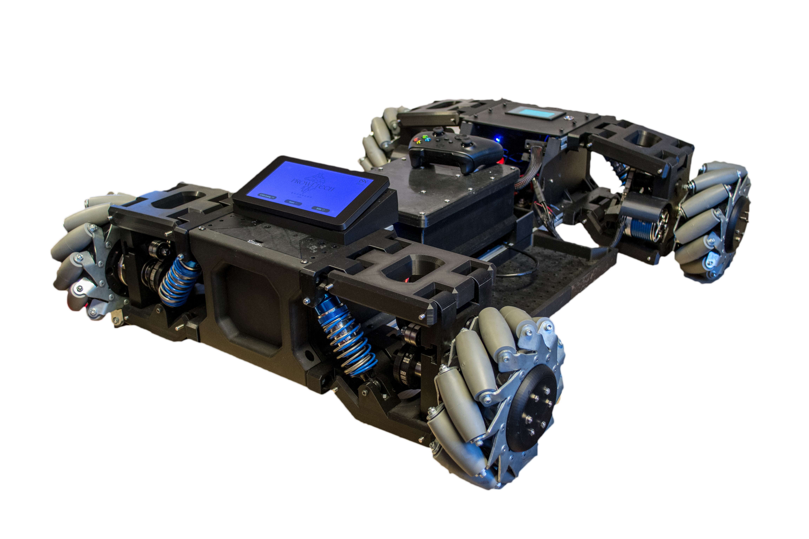
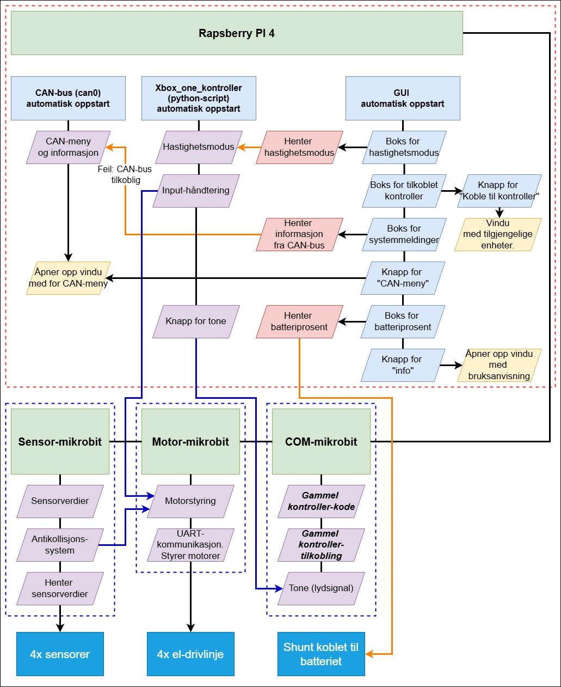
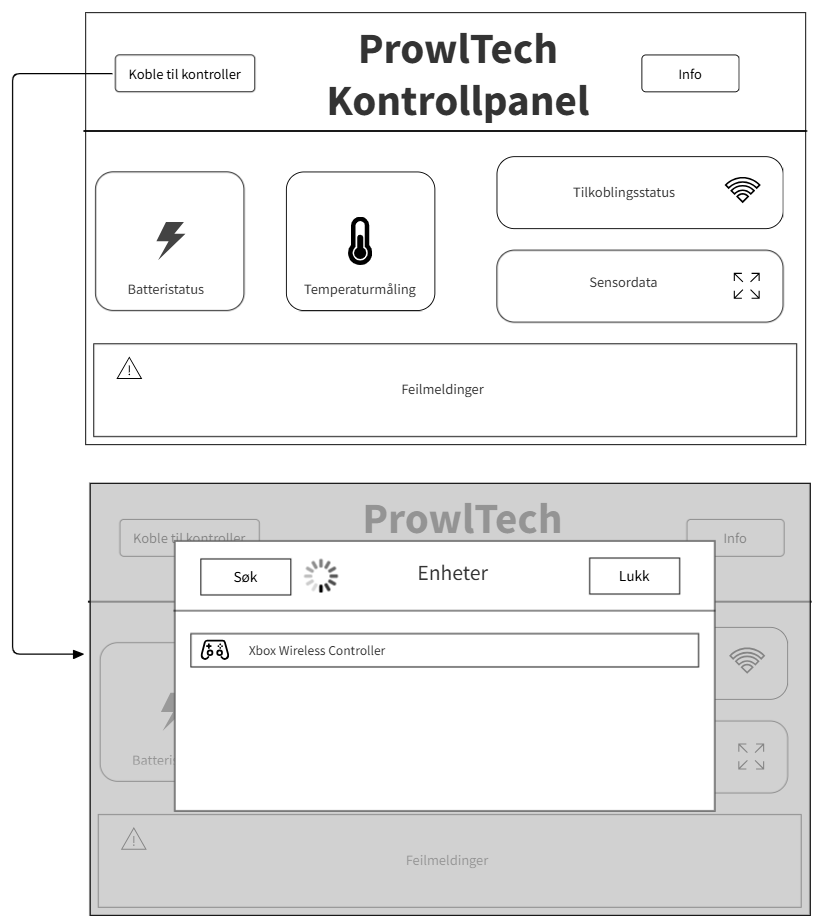
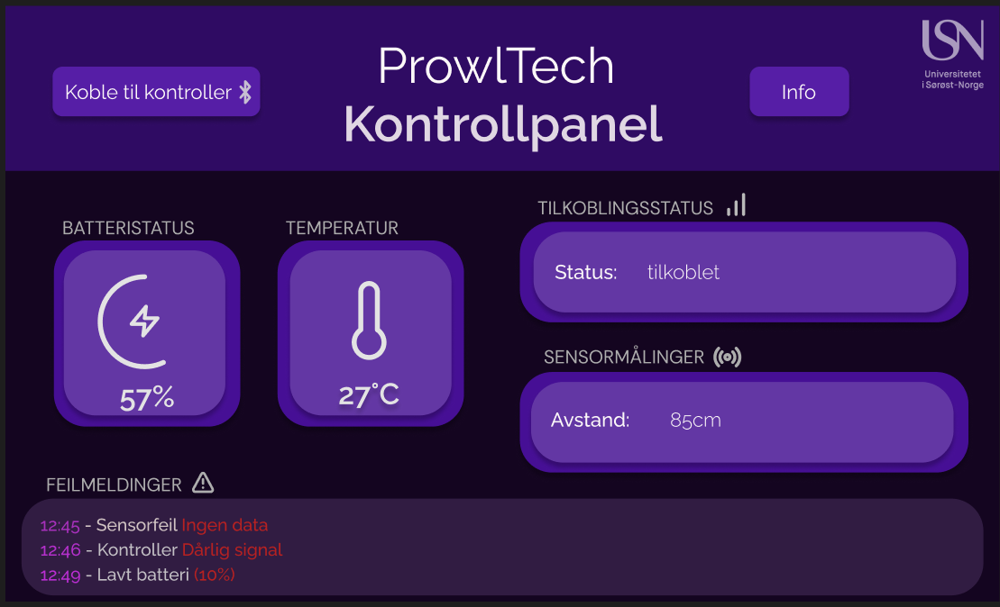

# ProwlTech
Bachelorgruppe 07 har forbedret en Mecanum-drevet bil med omnidireksjonell bevegelse ved å oppgradere både maskinvaren og programvaren. Ved hjelp av Zephyr på en Micro:bit ble en Raspberry Pi integrert som brukergrensesnitt. Årets ABC-krav ble oppfylt ved å forberede systemet for fremtidig autonom funksjonalitet gjennom modulær design og klargjøring.

# [ProwlTech](https://github.com/Antonio-Cezar/ProwlTech-USN-G07-25)

# ABC-kravene
For å sikre at systemet dekker de nødvendige funksjonene innenfor datadelen av prosjektet, ble det utarbeidet en kravliste. Disse kravene omhandler alt fra bevegelighet og brukergrensesnitt til sensor- og kommunikasjonsfunksjoner. Tabellen viser en oversikt over kravene for data, rangert
etter prioritet.

# ProwlTech ferdigstilte produkt

# Komponenter og tilkobling på kjøretøyet

Fordi systemet er bygd opp av flere komponenter, såa brukes CAN-bus-protokollen til å kommunisere med hverandre. 

• Motorkontrollene bruker VESC-tools til å kommunisere med hverandre via et eget CAN-bus-system. ´En motorkontroller fungerer som master-slave og de andre fire er slave.

• Raspberry Pi og de tre microbit-ene forbindes med hverandre med et eget CAN-bus-system som er utviklet av en tidligere bachelorgruppe og utvikles videre på i år.

• GUI-enheten består av en Raspberry Pi koblet til en touchskjerm, som gir sanntidsinformasjon og kontrollmuligheter.

• Strømforsyningen er distribuert via en 12V-regulator for motorer og en 5V-regulator for Raspberry Pi og microbit-ene.

• Sensorer er strategisk plassert for å registrere omgivelsesdata.

# Kommunikasjonsflyt
For å få et overblikk av informasjon utvekslingen mellom komponentene og hvilken typer programvarer som ligger i de ulike komponentene så er det laget et kommunikasjonsflyt diagram. I diagrammet kan man se komponenten i de grønne boksene og de ulike typer koder og funksjonaliteter de har. 

De grønne boksene representerer komponentene. Raspberry Pi prosesserer flere ulike funksjoner samtidig. Den har tre programmer der den ene er en CAN-bus kode som initialiserer og enheten can0 som er for modulen (MCP2515). Den har også en utviklet canbus-meny som skal gjøre det enklere å se status, starte på nytt kommunikasjonen.

Det er også et Bluetooth-kontroller Python-skript som behandler og sender bevegelighetsverdier videre til motor-microbit. Det har også blitt lagt til en funksjonalitet for avspilling av en tone ved knappetrykk.

Siste utviklet program på Raspberry Pi er GUI som. Dette er en visuell og interaktiv måte for å gi operatør av bilen et styrings panel for bilen. GUI som er utviklet har funksjonaliteter tilpasset behov for en operatør av bil som å kunne se status på batteri, hente ulike informasjoner og vise på vise det og koble til Bluetooth-kontroller.

Siste tre microbit-ene i diagrammet håndterer forskjellige deler av systemet. Det er en for sensor, motorstyring og COM. COM-microbit-en ble brukt før for tilkobling av en gammel kontroller, men denne ble byttet ut på grunn av manglende funksjonaliteter. For å ikke fjerne denne microbit-en helt fra system med tanke på andre mulige fremtidige oppgaver denne kan bli brukt for, så har den da ikke blitt fjernet fra systemet og heller lagt til en funksjonalitet for et lydsignal. Motormicrobit-en styrer EL-drivlinjene til bilen der det har blitt utviklet ny metode for styring. Til slutt så er det sensor-microbit som det ikke har blitt gjort noen nye endringer på og forblir den samme koden som ble utviklet av forrige bachelorgruppe.

# CAN-BUS kommunikasjons protokoll
CAN står for Controller Area Network og er en kommunikasjonsprotokoll. Denne protokollen har blitt implementert av gruppen Fenris på bilen og utviklet videre. CAN-bus-protokollen på bilen er infrastrukturen for datakomponentene på bilen som danner en kommunikasjonsbru for komponentene. 

CAN-bus-systemet gjør at bilen kan håndtere flere kommandoer samtidig, sensoravlesninger og systemmeldinger uten overbelastning. Dette er med på å lage et responsivt og stabilt system som kan skaleres opp med flere datakomponenter etter behov.

Figuren viser slik komponentene i systemet er koblet til CAN-bus-linjen. Figuren tar for seg også komponentene som var fra før og de som nå er implementert i systemet. Dette er lagt frem ved å dele opp i blå og røde bokser. De blå boksene på figuren er komponenter og tilkoblingsmetoder av tidligere bachelorgruppen Fenris. De røde boksene er de nye komponentene tilkoblet systemet.

# Mobilitet og kjøreretninge.

Kjøretøyet skal ha et avansert bevegelsessystem basert p˚a Mecanum-hjul, som skal gi flere kjørealternativer.
Ved at man kan kontrollere hvert hjul individuelt, kan kjøretøyet bevege seg i følgende retninger.
Figuren viser visuelt hvordan dette fungerer

# Kontroller

Det utviklede kontrolleroppsettet inkluderer alle minimumsfunksjoner fra tidligere faser, men er i tillegg utvidet med funksjonaliteter som gir mer avansert kontroll over bilen. Figuren viser en oversikt over funksjonene som er optimale for tredjepartskontrolleren, slik at bilen kan kontrolleres best mulig.

# GUI
Et av hovedkravene for systemet var å ha en integrert GUI som viser kritisk informasjon om kjøretøyets tilstand. GUI-et skal være et hjelpemiddel for brukeren av bilen som raskt skal kunne se batteristatus, status på hver enkelt sensor og eventuelle feilmeldinger fra systemet. Brukeren skal også kunne koble til og fra kontrollere. GUI-et skal være brukervennlig med et simpelt og oversiktlig design. For å gi en visuell oversikt over det ferdigutviklede systemet, vises skjermbilder av GUI-et.

